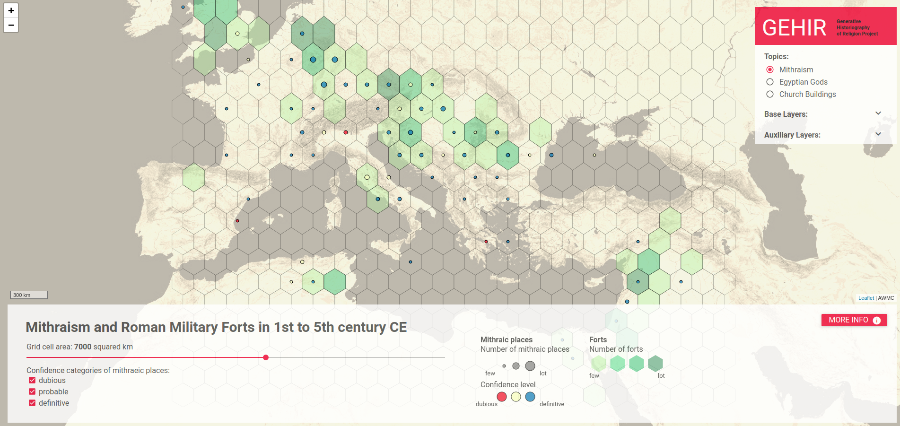
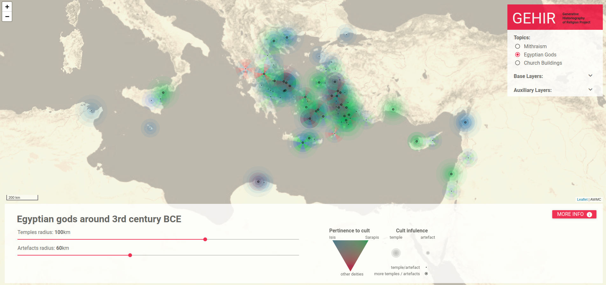
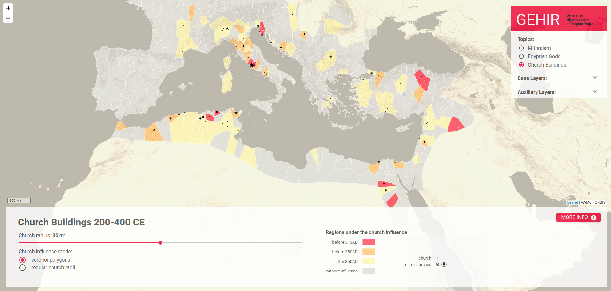

# GEHIR MAP APP

## APP

The map application is now deployed [here](http://gehir.phil.muni.cz/map/).

## Study

A paper [The role of spatial visual analysis in historical religious studies](https://geografie.cz/124/3/0265/) was published in 2019 in Geografie journal.

## Motivation

Map Application dedicated to the GEHIR project (gehir.phil.muni.cz) that brings the possibility of visual analysis in the research of history of ancient religions.

## Case studies

Three case studies were chosen based on the focus of the GEHIR project:

- **Mithraism and army forts** - ancient misterious religion (1st- 3rd century CE) with unknown origins that was strongly tied with Roman army
  
- **Isiac cults** - Egyptian cults that spreaded to the whole Medditeranean through the Ptolemaic era (305 - 167 BCE)
  
- **Christian buildings** - the goal of this case study is to discover the spread of Christianity based on the evidence of church buildings
  

## Technologies

Development was done with [webpack](https://webpack.js.org/), whole application is client side and written completely in javascript. [Leaflet](http://leafletjs.com/) library is used for the map, own visualisations were implemented from leaflet plugins ((regular-grid-cluster)[https://github.com/adammertel/Leaflet.RegularGridCluster], (segments-charts)[https://github.com/adammertel/leaflet-segments-charts])
